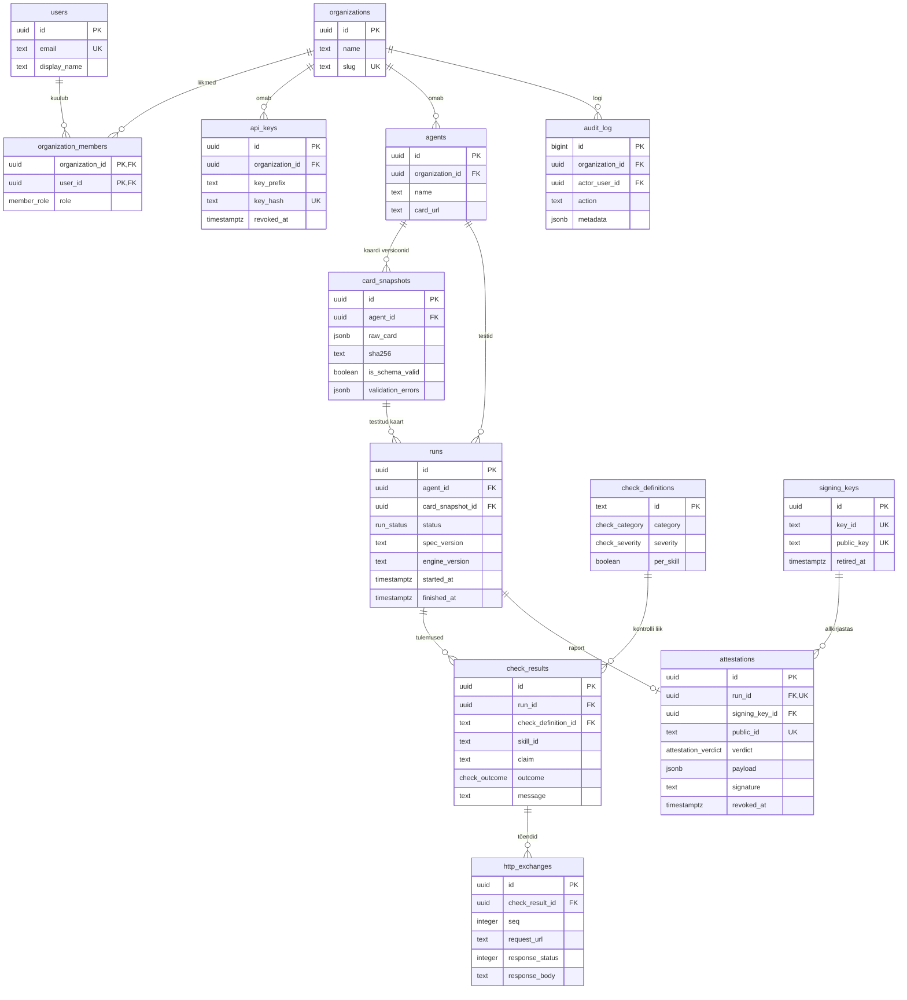
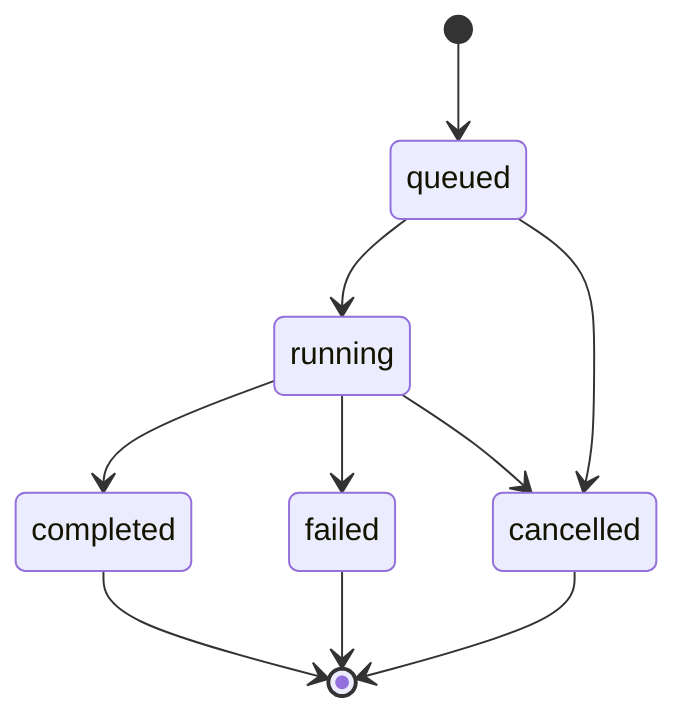

# Suncly andmebaas

See kaust sisaldab Suncly andmebaasi skeemi. Suncly laeb A2A agendi Agent Cardi, testib, kas agent teeb päriselt seda, mida kaart väidab, ja väljastab allkirjastatud atestatsiooni.

| Fail | Sisu |
|---|---|
| `migrations/0001_initial_schema.sql` | Kogu skeem ühe migratsioonina (PostgreSQL 13+) |
| `README.md` | See dokument: mis tabelid on ja miks |

## Käivitamine

```bash
psql "$DATABASE_URL" -v ON_ERROR_STOP=1 -f db/migrations/0001_initial_schema.sql
```

Migratsioon jookseb ühes transaktsioonis: kas kõik tabelid tekivad või mitte ükski. Supabase'is võib sama faili sisu kleepida SQL Editorisse.

## Kuidas andmed liiguvad

Üks test käib alati sama rada pidi:

1. Kasutaja lisab agendi (`agents`), andes Agent Cardi URL-i.
2. Kasutaja käivitab testi. Tekib rida tabelis `runs` staatusega `queued`.
3. Mootor laeb kaardi ja salvestab sellest täpse koopia (`card_snapshots`). Run läheb staatusesse `running`.
4. Mootor käib läbi kontrollide kataloogi (`check_definitions`) ja kirjutab iga kontrolli tulemuse (`check_results`).
5. Iga tulemuse juurde salvestatakse tõendina päris päringud ja vastused (`http_exchanges`).
6. Run läheb staatusesse `completed`. Mootor koostab raporti, allkirjastab selle ja salvestab (`attestations`).
7. Kolmas osapool kontrollib allkirja avaliku võtmega (`signing_keys`).

## Skeem



Diagrammil on ainult olulisemad veerud. Täielik loend koos kommentaaridega on SQL-failis.

## Tabelid

### 1. Kes Suncly't kasutab

| Tabel | Mis seal on | Tähtis teada |
|---|---|---|
| `organizations` | Klienditiim. Iga agent ja test kuulub täpselt ühele organisatsioonile. | `slug` on unikaalne, väiketähed, numbrid ja sidekriipsud. |
| `users` | Inimene, kes saab sisse logida. | Paroole siin ei hoita, need on autentimisteenuse asi. E-post on unikaalne tähesuurusest sõltumata. |
| `organization_members` | Kes kuulub millisesse organisatsiooni ja mis rollis (`owner`, `admin`, `member`). | Üks kasutaja võib olla mitmes organisatsioonis. |
| `api_keys` | Võtmed API kutsumiseks CI-st või skriptist. | Salvestatakse ainult võtme SHA-256 räsi. Võtit ennast ei salvestata kunagi. |

### 2. Mida testitakse

| Tabel | Mis seal on | Tähtis teada |
|---|---|---|
| `agents` | Testimiseks registreeritud A2A agent. | `card_url` peab algama `https://`. Sama URL saab ühes organisatsioonis olla ainult korra. |
| `card_snapshots` | Agent Cardi täpne koopia laadimise hetkel, koos SHA-256 räsiga. | Ei muudeta kunagi. Kui kaart muutub, tekib uus rida. Sama räsiga kaarti sama agendi kohta kaks korda ei salvestata. |

### 3. Millised kontrollid on olemas

| Tabel | Mis seal on | Tähtis teada |
|---|---|---|
| `check_definitions` | Kõigi kontrollide kataloog. | Ridu lisab migratsioon, mitte kasutaja. `id` on loetav tekst (nt `capability.streaming`) ja seda ei nimetata kunagi ümber. |

Esimese migratsiooniga lisatakse kümme kontrolli:

| id | Tõsidus | Mida kontrollib |
|---|---|---|
| `card.reachable` | critical | Kaardi URL vastab https kaudu |
| `card.schema_valid` | critical | Kaart vastab A2A skeemile |
| `transport.endpoint_reachable` | critical | Kaardil märgitud teenuse URL vastab |
| `capability.streaming` | major | Kui kaart lubab streamingut, siis see töötab |
| `capability.push_notifications` | major | Kui kaart lubab push-teavitusi, siis need töötavad |
| `skill.responds` | major | Skill vastab oma näidissisendile (iga skilli kohta eraldi) |
| `skill.output_modes` | major | Skill tagastab kaardil lubatud tüüpi vastuse (iga skilli kohta eraldi) |
| `error_handling.invalid_request` | minor | Vigane päring saab korrektse veateate |
| `error_handling.unknown_task` | minor | Tundmatu taski id saab korrektse veateate |
| `auth.enforced` | critical | Kui kaart nõuab autentimist, siis ilma selleta ligi ei saa |

### 4. Mis juhtus

| Tabel | Mis seal on | Tähtis teada |
|---|---|---|
| `runs` | Üks testimootori käivitus ühe agendi vastu. | Salvestab ka spetsifikatsiooni ja mootori versiooni, et tulemus oleks hiljem korratav. |
| `check_results` | Ühe kontrolli tulemus ühes runis. | `claim` = mida kaart väitis, `message` = mida Suncly nägi. `message` on kohustuslik, kui tulemus ei ole `pass`. |
| `http_exchanges` | Tõend: päris päringud ja vastused. | Autentimispäised tuleb rakenduses enne salvestamist eemaldada. |

Runi staatused:



`failed` tähendab, et Suncly ise läks katki (nt kaarti ei saanud laadida). See ei tähenda, et agent kukkus kontrollides läbi. Agendi läbikukkumine on `completed` run, mille tulemuste hulgas on `fail`.

Kontrolli tulemused (`check_outcome`):

| Väärtus | Tähendus |
|---|---|
| `pass` | Väide on tõene |
| `fail` | Väide on väär: agent ei tee seda, mida kaart lubab |
| `warn` | Töötab, aga kaldub spetsifikatsioonist kõrvale |
| `skipped` | Ei kohaldu (nt kaart ei luba streamingut) |
| `error` | Suncly ei saanud kontrolli lõpuni teha (timeout, võrguviga) |

### 5. Allkirjastatud tulemus

| Tabel | Mis seal on | Tähtis teada |
|---|---|---|
| `signing_keys` | Avalikud võtmed atestatsioonide kontrollimiseks. | Privaatvõti elab saladuste halduris, mitte kunagi andmebaasis. |
| `attestations` | Ühe lõpetatud runi allkirjastatud raport. | Runi kohta kõige rohkem üks. `public_id` on juhuslik ja läheb avalikku kontroll-URL-i. |

Otsus (`verdict`): `pass` = kõik kontrollid läbitud, `partial` = läbi kukkus ainult `minor` kontroll, `fail` = läbi kukkus `critical` või `major` kontroll.

### 6. Kes mida tegi

| Tabel | Mis seal on | Tähtis teada |
|---|---|---|
| `audit_log` | Tähtsate tegevuste logi (nt `agent.created`, `attestation.revoked`). | Ainult lisatakse. Jääb alles ka siis, kui organisatsioon või kasutaja kustutatakse. |

### Vaade

`run_summaries` annab iga runi kohta ühe rea koos tulemuste arvudega (mitu `pass`, `fail` jne). See arvutatakse päringu hetkel tabelist `check_results`, nii et arvud ei saa tegelike tulemustega vastuollu minna. Dashboardi nimekiri loeb seda vaadet.

## Reeglid, mida andmebaas ise jõustab

Need on kirjas `CHECK`-, `UNIQUE`- ja `FOREIGN KEY`-piirangutena, nii et vigane kood ei saa neid rikkuda.

- Run ei saa viidata teise agendi kaardile.
- Runi ajatemplid peavad staatusega klappima: `queued` runil pole algus- ega lõpuaega, `running` runil on algusaeg, lõpetatud runil on lõpuaeg.
- `completed` runil on alati kaart, mida testiti. `failed` runil on alati veateade.
- Sama kontrolli (ja sama skilli) kohta saab ühes runis olla ainult üks tulemus.
- Iga HTTP-tõend lõpeb kas vastuse või veaga.
- Kehtiva skeemiga kaardil ei ole valideerimisvigu.
- Räsid on alati 64 väiketähelist hex-märki.
- Tühistatud atestatsioonil on alati põhjus.

## Reeglid, mida peab jõustama rakendus

Andmebaas neid ei kontrolli, backend peab.

- Atestatsioon väljastatakse ainult `completed` runile.
- `http_exchanges` ridadest eemaldatakse enne salvestamist `Authorization`, API võtmed ja küpsised.
- Vastuse keha lõigatakse suuruse limiidi juures ära ja `body_truncated` pannakse `true`.
- Tabeleid `card_snapshots`, `check_results`, `http_exchanges` ja `audit_log` ei uuendata, ainult lisatakse.
- Ridade nähtavus organisatsiooni kaupa. Kui kasutate Supabase'i ja frontend loeb andmebaasi otse, tuleb lisada RLS-reeglid eraldi migratsioonina. Kui kõik käib läbi backendi API, filtreerib backend `organization_id` järgi.

## Kustutamine

Organisatsiooni kustutamine kustutab kõik tema agendid, kaardid, runid, tulemused, tõendid ja atestatsioonid. Auditilogi read jäävad alles, organisatsiooni viide muutub tühjaks. Kasutaja kustutamine ei kustuta tema käivitatud rune, ainult viide temale muutub tühjaks. Allkirjastamisvõtit, millega on atestatsioone allkirjastatud, kustutada ei saa.

## Skeemi muutmine

Olemasolevat migratsioonifaili ei muudeta pärast seda, kui see on kuskil käivitatud. Iga muudatus on uus fail: `0002_...sql`, `0003_...sql` jne. Uus kontroll lisatakse samuti migratsiooniga (`INSERT INTO check_definitions`).
