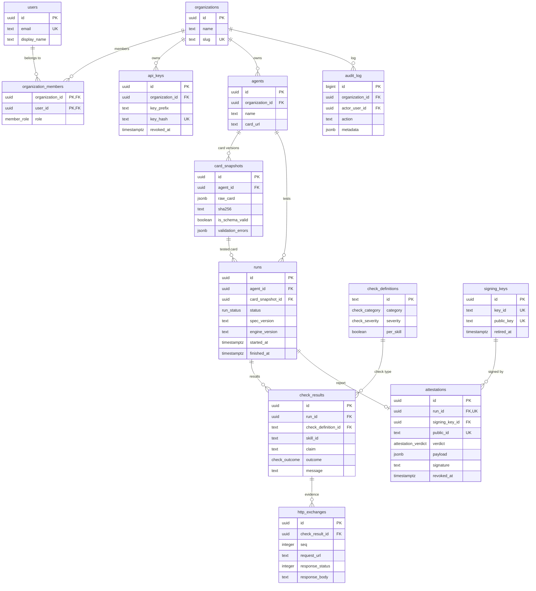
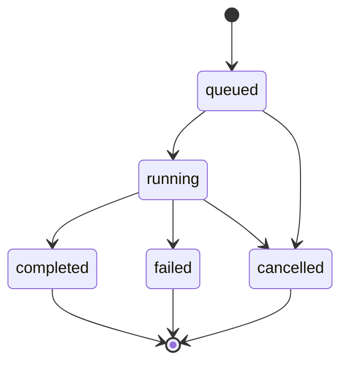

# Suncly database

This folder contains the Suncly database schema. Suncly fetches an A2A agent's Agent Card, tests whether the agent really does what the card claims, and issues a signed attestation.

| File | Contents |
|---|---|
| `migrations/0001_initial_schema.sql` | The whole schema as one migration (PostgreSQL 13+) |
| `README.md` | This document: which tables exist and why |

## Running it

```bash
psql "$DATABASE_URL" -v ON_ERROR_STOP=1 -f db/migrations/0001_initial_schema.sql
```

The migration runs in a single transaction: either every table is created or none is. On Supabase you can paste the same file into the SQL Editor.

## How data flows

Every test follows the same path:

1. A user adds an agent (`agents`) by giving its Agent Card URL.
2. The user starts a test. A row appears in `runs` with status `queued`.
3. The engine fetches the card and stores an exact copy of it (`card_snapshots`). The run moves to `running`.
4. The engine walks through the check catalog (`check_definitions`) and writes the outcome of each check (`check_results`).
5. For each outcome, the real requests and responses are stored as evidence (`http_exchanges`).
6. The run moves to `completed`. The engine builds the report, signs it and stores it (`attestations`).
7. A third party verifies the signature with the public key (`signing_keys`).

## Schema



The diagram shows only the most important columns. The full list, with comments, is in the SQL file.

## Tables

### 1. Who uses Suncly

| Table | What it holds | Good to know |
|---|---|---|
| `organizations` | A customer team. Every agent and test belongs to exactly one organization. | `slug` is unique: lowercase letters, digits and hyphens. |
| `users` | A person who can log in. | Passwords are not stored here; that is the auth provider's job. Email is unique regardless of letter case. |
| `organization_members` | Who belongs to which organization and in what role (`owner`, `admin`, `member`). | One user can be in several organizations. |
| `api_keys` | Keys for calling the API from CI or a script. | Only the SHA-256 hash of the key is stored. The key itself is never stored. |

### 2. What is tested

| Table | What it holds | Good to know |
|---|---|---|
| `agents` | An A2A agent registered for testing. | `card_url` must start with `https://`. The same URL can exist only once per organization. |
| `card_snapshots` | An exact copy of the Agent Card at fetch time, with its SHA-256 hash. | Never modified. If the card changes, a new row is created. A card with the same hash is not stored twice for the same agent. |

### 3. Which checks exist

| Table | What it holds | Good to know |
|---|---|---|
| `check_definitions` | The catalog of all checks. | Rows are added by migrations, not by users. `id` is readable text (e.g. `capability.streaming`) and is never renamed. |

The first migration adds ten checks:

| id | Severity | What it checks |
|---|---|---|
| `card.reachable` | critical | The card URL answers over https |
| `card.schema_valid` | critical | The card matches the A2A schema |
| `transport.endpoint_reachable` | critical | The service URL declared on the card answers |
| `capability.streaming` | major | If the card declares streaming, it works |
| `capability.push_notifications` | major | If the card declares push notifications, they work |
| `skill.responds` | major | The skill responds to its own example (once per skill) |
| `skill.output_modes` | major | The skill returns a response type the card allows (once per skill) |
| `error_handling.invalid_request` | minor | A malformed request gets a proper error |
| `error_handling.unknown_task` | minor | An unknown task id gets a proper error |
| `auth.enforced` | critical | If the card requires authentication, access without it is refused |

### 4. What happened

| Table | What it holds | Good to know |
|---|---|---|
| `runs` | One execution of the test engine against one agent. | Also stores the spec and engine version so the result can be reproduced later. |
| `check_results` | The outcome of one check in one run. | `claim` = what the card claimed, `message` = what Suncly observed. `message` is required unless the outcome is `pass`. |
| `http_exchanges` | Evidence: the real requests and responses. | Auth headers must be removed by the application before saving. |

Run statuses:



`failed` means Suncly itself broke (e.g. the card could not be fetched). It does not mean the agent failed its checks. An agent failing is a `completed` run that has `fail` among its results.

Check outcomes (`check_outcome`):

| Value | Meaning |
|---|---|
| `pass` | The claim is true |
| `fail` | The claim is false: the agent does not do what the card promises |
| `warn` | Works, but deviates from the specification |
| `skipped` | Not applicable (e.g. the card does not declare streaming) |
| `error` | Suncly could not finish the check (timeout, network error) |

### 5. The signed result

| Table | What it holds | Good to know |
|---|---|---|
| `signing_keys` | Public keys for verifying attestations. | The private key lives in the secret manager, never in the database. |
| `attestations` | The signed report for one finished run. | At most one per run. `public_id` is random and goes into the public verification URL. |

Verdict: `pass` = all checks passed, `partial` = only a `minor` check failed, `fail` = a `critical` or `major` check failed.

### 6. Who did what

| Table | What it holds | Good to know |
|---|---|---|
| `audit_log` | Log of important actions (e.g. `agent.created`, `attestation.revoked`). | Append-only. Survives even if the organization or user is deleted. |

### View

`run_summaries` gives one row per run with the outcome counts (how many `pass`, `fail` and so on). It is computed at query time from `check_results`, so the numbers cannot disagree with the real results. The dashboard list reads this view.

## Rules the database enforces

These are written as `CHECK`, `UNIQUE` and `FOREIGN KEY` constraints, so buggy code cannot break them.

- A run cannot point at another agent's card.
- Run timestamps must agree with the status: a `queued` run has no start or end time, a `running` run has a start time, a finished run has an end time.
- A `completed` run always has the card it tested. A `failed` run always has an error message.
- There can be only one result per check (and per skill) in a run.
- Every HTTP exchange ends in either a response or an error.
- A card with a valid schema has no validation errors.
- Hashes are always 64 lowercase hex characters.
- A revoked attestation always has a reason.

## Rules the application must enforce

The database does not check these; the backend must.

- An attestation is issued only for a `completed` run.
- `Authorization` headers, API keys and cookies are removed from `http_exchanges` rows before saving.
- The response body is cut at the size limit and `body_truncated` is set to `true`.
- `card_snapshots`, `check_results`, `http_exchanges` and `audit_log` are never updated, only inserted into.
- Row visibility per organization. If you use Supabase and the frontend reads the database directly, add RLS policies as a separate migration. If everything goes through the backend API, the backend filters by `organization_id`.

## Deleting

Deleting an organization deletes all of its agents, cards, runs, results, evidence and attestations. Audit log rows stay, with the organization reference set to empty. Deleting a user does not delete the runs they started; only the reference to them becomes empty. A signing key that has signed attestations cannot be deleted.

## Changing the schema

An existing migration file is never edited once it has been run anywhere. Every change is a new file: `0002_...sql`, `0003_...sql` and so on. A new check is also added with a migration (`INSERT INTO check_definitions`).
