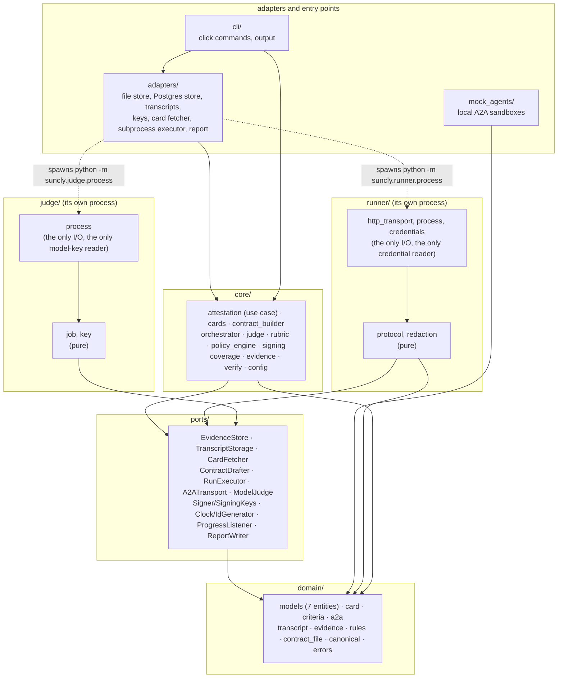
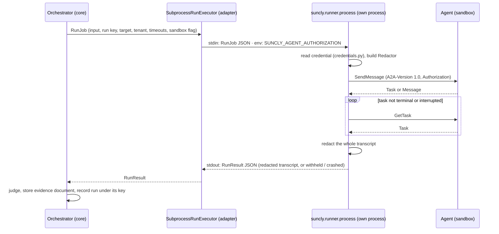

# Code architecture

How the code maps to the components of [ARCHITECTURE.md](ARCHITECTURE.md),
and the rules that keep the boundaries hard. Every rule here is enforced by a
test in `tests/unit/test_architecture.py`.

## Layers

Dependencies point inward only. The domain and the core never import an
adapter; ports import only the domain.



| Layer | May import | Does I/O |
|---|---|---|
| `domain` | stdlib, pydantic, rfc8785, jsonschema (pure computation) | no |
| `ports` | `domain` | no (Protocols only) |
| `core` | `domain`, `ports`, cryptography (pure computation) | no |
| `runner` | `domain`, `ports`; `http_transport`, `process` and `credentials` do I/O | only those three modules |
| `judge` | `domain`, `ports`; never `runner`; `process` does I/O | only that module |
| `adapters` | everything but `cli` | yes |
| `mock_agents` | `domain` | yes (local HTTP server) |
| `cli` | everything | yes |

## Components to modules

| Component (ARCHITECTURE.md) | Module(s) | Notes |
|---|---|---|
| Contract builder | `core/contract_builder.py` | `DeterministicDrafter` implements `ports/drafter.py::ContractDrafter`; `ContractService` records drafts, versions and the human approval. A model-based drafter (stage 2) implements the same port. |
| Orchestrator | `core/orchestrator.py` | In-process (OQ-R1). Expansion, run keys, concurrency, retries under the same key, timeouts, the budget cap, the card re-fetch. Holds no credentials; calls the Runner only through `ports/run_executor.py`. |
| Runner | `runner/` | Separate process started by `adapters/subprocess_executor.py`. `protocol.py` is the pure A2A client logic over `ports/a2a.py`; `http_transport.py` is the single place that enforces "only the target host"; `credentials.py` is the single reader of the credential; `redaction.py` removes secrets before the result leaves. |
| Judge (Layer 1) | `core/judge.py` | `judge_run` is pure; `JudgeService` stores the evidence document and records the run. |
| Judge (Layer 2) | `core/judge.py`, `core/rubric.py`, `ports/model_judge.py`, `judge/`, `adapters/judge_subprocess.py` | `judge_with_model` is pure and asks the `ModelJudge` port once per undecided model check; `rubric.py` is the versioned frame. The judge subprocess (`judge/process.py`) is the only holder of the model key and talks to one endpoint; `judge/key.py` is the single reader of the key. See [STAGE_4_BRIEF.md](STAGE_4_BRIEF.md). |
| Evidence store | `ports/store.py`, `adapters/file_store.py`, `adapters/postgres/store.py`, `domain/rules.py` | Both stores pass `tests/stores/test_store_contract.py`. The rules module holds the application-level twins of the database constraints. |
| Transcript storage | `ports/transcripts.py`, `adapters/local_transcripts.py` | Write-once. Object storage later implements the same port. |
| Policy engine | `core/policy_engine.py` | The only place that aggregates results. Flag-only until a policy configuration exists; no numeric threshold anywhere. |
| Signing | `core/signing.py`, `ports/signer.py`, `adapters/file_keys.py` | Payload of schema §11, Ed25519. |
| Report adapter | `adapters/report/` | `view.py` computes the content once; `markdown.py` and `html.py` render it; `writer.py` writes the folder. |
| Registry adapter, CI adapter, HTTP API | `adapters/registry.py`, `adapters/ci.py`, `api.py` | Placeholders for stages 6 and 5. |
| Attestation use case | `core/attestation.py` | The core library the CLI calls (schema §6); the HTTP API calls the same `AttestationService`. |
| Verifier | `core/verify.py` | Works from a report folder alone. |
| Coverage of what was NOT tested | `core/coverage.py` | Computed once; shown by the CLI and both reports. |
| Configuration | `core/config.py`, `adapters/config_loader.py` | One frozen object: defaults, then `SUNCLY_HOME/config.toml`, then `SUNCLY_*` environment variables. |
| CLI | `cli/` | Parses, prompts, prints and calls the core. `exit_codes.py` documents every code. |
| Mock agents | `mock_agents/` | Ten behaviours with documented expected results; used by `suncly demo` and the end-to-end tests. |

## The Runner boundary



- The job carries no credential; a test proves the `RunJob` schema has none.
- Nothing from the child's stderr is surfaced.
- A credential that the agent echoes back is redacted like any other string.

## The judge boundary

The second subprocess, for Layer 2, follows the same pattern with a stricter
environment ([STAGE_4_BRIEF.md](STAGE_4_BRIEF.md)):

```mermaid
sequenceDiagram
    participant J as JudgeService (core)
    participant X as SubprocessModelJudge (adapter)
    participant P as suncly.judge.process (own process)
    participant M as Model endpoint (configured)
    J->>X: ModelRequest (pinned model id, prompt, timeout)
    X->>P: stdin: JudgeJob JSON · env built from scratch: SUNCLY_JUDGE_MODEL_KEY only
    P->>P: read the key (key.py)
    P->>M: POST prompt (Authorization: Bearer key); one host only, no redirects
    M-->>P: model id, output text
    P->>P: redact the key from text, model id and errors
    P-->>X: stdout: ModelResponse JSON
    X-->>J: ModelResponse
    J->>J: interpret the answer, record model id, rubric version and hash, prompt, raw response, rationale
```

- The core builds the prompt and interprets the answer; the subprocess only
  carries it. The port carries no key and no endpoint.
- The judge job and the run job share no field; the two processes share no
  variable.

## Where to add what

| Change | Touch |
|---|---|
| A model-based Contract builder (stage 2) | A new class implementing `ports/drafter.py::ContractDrafter`; swap it in `cli/wiring.py`. |
| A real model provider for Layer 2 | Replace `call_endpoint` in `judge/process.py` (the placeholder wire shape); nothing in the core changes. A new rubric frame is a new `RUBRIC_VERSION` in `core/rubric.py`, which the configuration must then name (DR-004). |
| A configured Policy engine (stage 5) | Replace `core/policy_engine.py::decide`; read thresholds from a policy configuration; keep `aggregate`. |
| The HTTP API (stage 5) | `api.py` calling `AttestationService` with the same `Services`. |
| CI and registry adapters (stages 5 and 6) | `adapters/ci.py`, `adapters/registry.py`, reading `EvidenceBundle`. |
| Another A2A binding, or the official SDK | A class implementing `ports/a2a.py::A2ATransport`; extend `core/cards.py::select_interface`. |
| Object storage for transcripts | A class implementing `ports/transcripts.py::TranscriptStorage`. |
| A queue (the job table) | Replace the thread pool in `core/orchestrator.py`; the run key and the budget logic stay. |

## Tests that enforce the architecture

| Test | Rule |
|---|---|
| `test_imports_point_inward_only` | The layer table above. |
| `test_domain_and_ports_import_no_io_libraries`, `test_core_does_no_io`, `test_runner_protocol_logic_is_pure` | No I/O libraries where none belong. |
| `test_only_the_runner_reads_the_credential` | `SUNCLY_AGENT_AUTHORIZATION` is named in exactly one source module. |
| `test_only_the_judge_subprocess_names_the_model_key_variable`, `test_the_judge_package_does_io_in_one_module_and_never_imports_the_runner` | `SUNCLY_JUDGE_MODEL_KEY` is named in exactly one source module; the judge package does I/O in `process` only and never imports the Runner. |
| `test_no_code_path_constructs_an_approve_or_block_decision` | `DecisionOutcome.APPROVE` and `.BLOCK` appear only in the enum. |
| `test_enum_values_are_exactly_the_schemas`, `test_entity_fields_are_exactly_the_schemas` | Names are the schema's. |
| `test_packaged_migration_matches_the_db_folder` | The migration shipped in the package is byte-identical to `db/migrations`. |
| `test_placeholders_for_later_stages_hold_only_a_docstring` | Out-of-scope modules stay empty. |

Enum members are written in upper case (`RunVerdict.PASS`); their values are
the schema's exact lowercase strings (`"pass"`). `pass` is a Python keyword,
so the member names could not follow the values.
