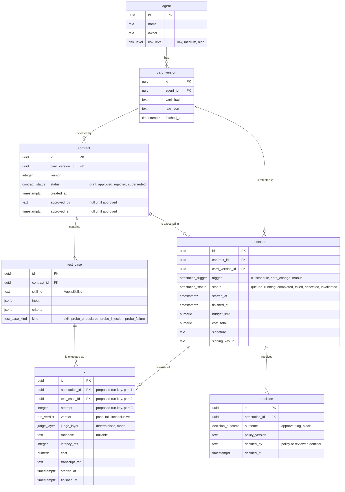

# Data model

Suncly stores seven entities. "These seven entities are the complete list"
(schema §3). Schema §11 adds fields and enums and overrides schema §3 where
they differ. Tables live in Postgres and transcripts in object storage
(schema §7).

**About types.** The schema names fields but gives no types. The types below
are **Proposed** Postgres types, chosen to make the model concrete
([OQ-D1](#open-questions)). Field names, entity names and enum values are
exactly the schema's.

Conventions are as in [ARCHITECTURE.md](ARCHITECTURE.md): "schema §N" refers
to [SCHEMA.md](../SCHEMA.md), **Proposed** marks what the schema does not
define, and `OQ-…` marks open questions.

## Overview

| Entity | What it records |
|---|---|
| `agent` | An agent under attestation, its owner and its risk level. |
| `card_version` | One fetched Agent Card, identified by its hash: the raw JSON and the hash ([OQ-D9](#open-questions)). |
| `contract` | A versioned set of test cases for one card version, drafted by a model and approved by a human. |
| `test_case` | One test in a contract, for a declared skill or a probe. |
| `attestation` | One execution of a contract against the agent, run once the contract is approved, with its budget and signature. |
| `run` | One execution of one test case: the transcript reference, verdict, timings and cost. |
| `decision` | A policy outcome for an attestation, made automatically or by a human. |

## Entity relationship diagram

## Entities

In the tables below:

- "Null" says whether the field may be empty.
- "Source" is the schema section that defines the field.
- Types, and nullability the schema does not state, are **Proposed**.

### agent

| Field | Type | Null | Key | Meaning | Source |
|---|---|---|---|---|---|
| `id` | uuid | no | PK | | §3 |
| `name` | text | no | | Human-readable name of the agent. | §3 |
| `owner` | text | no | | Who owns the agent in the customer's organization. The format is not defined. | §3 |
| `risk_level` | enum `risk_level` | no | | `low`, `medium` or `high`. Drives the approval rules in [POLICY.md](POLICY.md). | §3 |

How an agent is created, and who sets `risk_level`, is not defined
([OQ-P2](API.md#open-questions)).

### card_version

| Field | Type | Null | Key | Meaning | Source |
|---|---|---|---|---|---|
| `id` | uuid | no | PK | | §3 |
| `agent_id` | uuid | no | FK → `agent.id` | The agent whose card this is. | §3 |
| `card_hash` | text | no | | Hash of the canonicalized Agent Card. The algorithm and canonicalization are open ([OQ-A7](ARCHITECTURE.md#open-questions)). | §3 |
| `raw_json` | text | no | | The Agent Card exactly as fetched. **Proposed:** `text` rather than `jsonb`, because `jsonb` normalizes whitespace, key order and duplicate keys, so the stored value would no longer be exactly what was fetched ([OQ-D1](#open-questions)). | §3 |
| `fetched_at` | timestamptz | no | | When a card with this hash was first fetched ([OQ-D9](#open-questions)). | §3 |

The Agent Card's own fields (`skills`, `supportedInterfaces` and so on) are
described in
[ARCHITECTURE.md: A2A protocol dependencies](ARCHITECTURE.md#a2a-protocol-dependencies).
Suncly keeps them inside `raw_json` and does not split them into columns.

### contract

| Field | Type | Null | Key | Meaning | Source |
|---|---|---|---|---|---|
| `id` | uuid | no | PK | | §3 |
| `card_version_id` | uuid | no | FK → `card_version.id` | The card version the contract tests. | §3 |
| `version` | integer | no | | The contract's version number. An edit to an approved contract creates a new version (schema §2). Whether numbers are assigned per card version or per agent is open ([OQ-D5](#open-questions)). | §3 |
| `status` | enum `contract_status` | no | | `draft`, `approved`, `rejected` or `superseded`. | §11 |
| `created_at` | timestamptz | no | | When the contract was created. | §11 |
| `approved_by` | text | yes | | Identifier of the human who approved the contract. Null until approved. | §3, §11 |
| `approved_at` | timestamptz | yes | | When it was approved. Null until approved. | §3, §11 |

### test_case

| Field | Type | Null | Key | Meaning | Source |
|---|---|---|---|---|---|
| `id` | uuid | no | PK | | §3 |
| `contract_id` | uuid | no | FK → `contract.id` | The contract the test case belongs to. | §3 |
| `skill_id` | text | open | | The `id` of the declared `AgentSkill` (A2A §4.4.5) this case exercises. Its nullability for probes is open ([OQ-D7](#open-questions)). | §3 |
| `input` | jsonb | no | | What the Runner sends to the agent. The format is open ([OQ-D7](#open-questions)). | §3 |
| `criteria` | jsonb | no | | What the Judge checks, including the Layer 1 checks such as the latency limit. The format is open ([OQ-D7](#open-questions)). | §3 |
| `kind` | enum `test_case_kind` | no | | `skill`, `probe_undeclared`, `probe_injection` or `probe_failure`. | §3 |

### attestation

| Field | Type | Null | Key | Meaning | Source |
|---|---|---|---|---|---|
| `id` | uuid | no | PK | | §3 |
| `contract_id` | uuid | no | FK → `contract.id` | The contract being executed. | §3 |
| `card_version_id` | uuid | no | FK → `card_version.id` | The card version fetched for this attestation. **Proposed:** always equal to the contract's `card_version_id` ([OQ-D6](#open-questions)). | §11 |
| `trigger` | enum `attestation_trigger` | no | | `ci`, `schedule`, `card_change` or `manual`. | §3, §11 |
| `status` | enum `attestation_status` | no | | `queued`, `running`, `completed`, `failed`, `cancelled` or `invalidated`. | §3, §11 |
| `started_at` | timestamptz | no | | **Proposed:** when the attestation record is created ([OQ-D6](#open-questions)). | §3 |
| `finished_at` | timestamptz | yes | | When it reached `completed`, `failed`, `cancelled` or `invalidated`. Null until then. | §11 |
| `budget_limit` | numeric | no | | The cost cap. The unit is open ([OQ-D1](#open-questions)). | §11 |
| `cost_total` | numeric | no | | Cost accumulated so far. **Proposed:** the cost of every attempt, including retried attempts whose results were not recorded, so it can exceed the sum of `run.cost` ([OQ-D1](#open-questions)). | §11 |
| `signature` | text | yes | | The signature over the payload defined in schema §11. Null until signed. The encoding is open ([OQ-A8](ARCHITECTURE.md#open-questions)). | §3 |
| `signing_key_id` | text | yes | | Identifies the key of the Suncly deployment that signed. Null until signed. | §11 |

There is no policy outcome on `attestation`. Outcomes live in `decision`
(schema §11).

### run

| Field | Type | Null | Key | Meaning | Source |
|---|---|---|---|---|---|
| `id` | uuid | no | PK | | §3 |
| `attestation_id` | uuid | no | FK → `attestation.id` | Part of the run key. | §3 |
| `test_case_id` | uuid | no | FK → `test_case.id` | Part of the run key. | §3 |
| `attempt` | integer | no | | The repetition number of this test case within the attestation, from 1 to the number of repetitions. Part of the run key. This reading is an interpretation ([OQ-D3](#open-questions)). | §3 |
| `verdict` | enum `run_verdict` | no | | `pass`, `fail` or `inconclusive`. | §3 |
| `judge_layer` | enum `judge_layer` | no | | `deterministic` or `model`: the layer that decided the verdict ([OQ-D4](#open-questions)). | §11 |
| `rationale` | text | yes | | The Layer 2 rationale. Required when `judge_layer` is `model`. | §2, §11 |
| `latency_ms` | integer | yes | | The agent's response time. **Proposed:** null when there was no response ([OQ-D10](#open-questions)). | §3, §11 |
| `cost` | numeric | no | | The cost of this run ([OQ-D1](#open-questions)). | §3 |
| `transcript_ref` | text | no | | Reference to the redacted transcript in object storage. | §3, §7 |
| `started_at` | timestamptz | no | | Start of the whole run. | §11 |
| `finished_at` | timestamptz | no | | End of the whole run. | §11 |

**Proposed** unique key: (`attestation_id`, `test_case_id`, `attempt`). This
is the deterministic run key that keeps retries from double counting
([DR-001](DECISIONS.md#dr-001-idempotent-runs)).

### decision

| Field | Type | Null | Key | Meaning | Source |
|---|---|---|---|---|---|
| `id` | uuid | no | PK | | §3 |
| `attestation_id` | uuid | no | FK → `attestation.id` | The attestation decided on. | §3 |
| `outcome` | enum `decision_outcome` | no | | `approve`, `flag` or `block`. | §3 |
| `policy_version` | text | no | | The version of the customer's policy configuration (thresholds per risk level) that produced the decision ([OQ-D11](#open-questions)). | §3 |
| `decided_by` | text | no | | `"policy"` for automatic decisions, otherwise the reviewer's identifier. | §3, §11 |
| `decided_at` | timestamptz | no | | When the decision was made. | §11 |

## Enumerations

| Enum | Values | Source |
|---|---|---|
| `agent.risk_level` | `low`, `medium`, `high` | §3 |
| `contract.status` | `draft`, `approved`, `rejected`, `superseded` | §11 |
| `test_case.kind` | `skill`, `probe_undeclared`, `probe_injection`, `probe_failure` | §3 |
| `attestation.trigger` | `ci`, `schedule`, `card_change`, `manual` | §11 |
| `attestation.status` | `queued`, `running`, `completed`, `failed`, `cancelled`, `invalidated` | §11 |
| `run.verdict` | `pass`, `fail`, `inconclusive` | §3 |
| `run.judge_layer` | `deterministic`, `model` | §11 |
| `decision.outcome` | `approve`, `flag`, `block` | §3 |

`decision.decided_by` is not an enum. It holds either `"policy"` or a
reviewer's identifier (schema §11).

### Value meanings

- **`agent.risk_level`.** The schema's examples are `low` for a read-only
  lookup, `medium` for writes to internal systems, and `high` for payments or
  personal data (schema §5).
- **`contract.status`.**
  - `draft`: drafted and waiting for human approval.
  - `approved`: approved by a human, and immutable.
  - `rejected`: rejected by a human. There is no interface for this yet
    ([OQ-P2](API.md#open-questions)).
  - `superseded`: replaced by a newer contract. When exactly is open
    ([OQ-D5](#open-questions)).
- **`test_case.kind`.** The schema gives these values without definitions. The
  working definitions below need confirming ([OQ-D7](#open-questions)):
  - `skill`: exercises a declared skill.
  - `probe_undeclared`: probes behaviour the card does not declare.
  - `probe_injection`: probes how the agent handles injected instructions.
  - `probe_failure`: probes how the agent behaves under failure conditions.
- **`attestation.trigger`.**
  - `ci`: started from a CI pipeline.
  - `schedule`: started by a schedule.
  - `card_change`: started because the card changed. How the change is noticed
    is open ([OQ-F2](FLOW.md#open-questions)).
  - `manual`: started by a person, for example from the CLI.
- **`attestation.status`.** See [FLOW.md: Attestation status](FLOW.md#attestation-status).
  The spelling `cancelled` is the schema's. It is unrelated to the A2A task
  state `TASK_STATE_CANCELED`.
- **`run.verdict`.** `inconclusive` is never counted as a pass (schema §2).
- **`run.judge_layer`.** `deterministic` when Layer 1 decided the verdict,
  `model` when Layer 2 did.
- **`decision.outcome`.** `approve`; `flag`, which schema §2 calls "flag for
  human review"; and `block`.

## Relationships

| Foreign key | References | Cardinality | Meaning |
|---|---|---|---|
| `card_version.agent_id` | `agent.id` | an agent has 0..n card versions | One record per fetched card with a new hash. |
| `contract.card_version_id` | `card_version.id` | a card version has 0..n contracts | Drafts, rejected drafts and later versions. |
| `test_case.contract_id` | `contract.id` | a contract has 1..n test cases | At least one per declared skill. |
| `attestation.contract_id` | `contract.id` | a contract has 0..n attestations | Each execution of the contract. |
| `attestation.card_version_id` | `card_version.id` | a card version has 0..n attestations | The card version fetched for the attestation. |
| `run.attestation_id` | `attestation.id` | an attestation has 0..n runs | Test cases times repetitions. |
| `run.test_case_id` | `test_case.id` | a test case has 0..n runs | Its repetitions across attestations. |
| `decision.attestation_id` | `attestation.id` | an attestation has 0..n decisions | The policy decision, and a human decision when that was `flag` (schema §11). **Proposed:** corrections are further records ([OQ-D11](#open-questions)). |

## Invariants

Each rule is either taken from the schema (with its section) or marked
**Proposed**.

1. Every contract has at least one test case per declared skill (schema §2).
2. An approved contract and its test cases never change. An edit creates a new
   contract version (schema §2). Whether the move from `approved` to
   `superseded` counts as a change is open ([OQ-D5](#open-questions)).
3. `approved_by` and `approved_at` are null until the contract is approved
   (schema §11).
4. Runs are executed only for a contract whose `status` is `approved`
   (schema §4, step 2).
5. **Proposed:** `attestation.card_version_id` equals the contract's
   `card_version_id` ([OQ-D6](#open-questions)).
6. **Proposed:** (`attestation_id`, `test_case_id`, `attempt`) is unique, which
   enforces the deterministic run key (schema §8,
   [OQ-D3](#open-questions)).
7. `run.rationale` is present whenever `run.judge_layer` is `model`
   (schema §2: "stored rationale").
8. `inconclusive` is never counted as a pass in any aggregation (schema §2).
9. No run is enqueued once `cost_total` has reached `budget_limit`
   (schema §11).
10. An attestation that ended `failed` or `invalidated` has no decision
    (schema §11). **Proposed:** neither does a `cancelled` one
    ([OQ-D6](#open-questions)).
11. The first decision has `decided_by` `"policy"`, because the Policy
    engine decides (schema §4, step 6). When its `outcome` is `flag`, a human
    resolution is recorded as a second decision (schema §11). **Proposed:**
    any later decision is a correction, recorded as a new record (schema §8;
    [OQ-D11](#open-questions)).
12. `run` and `decision` records are never updated or deleted (schema §2, §8,
    §11).
13. **Proposed:** a `completed` attestation has a decision and a signature,
    because deciding and signing are the last core step (schema §4, step 6;
    [OQ-D6](#open-questions)).

## Mutability

Which component writes each entity, and what may change afterwards. Writers
the schema does not name are **Proposed**.

| Entity | Written by | After creation |
|---|---|---|
| `agent` | Not defined ([OQ-P2](API.md#open-questions)). | Not defined. |
| `card_version` | The card service, on behalf of the attestation use case (decided 2026-10-04, [OQ-A7](ARCHITECTURE.md#open-questions)). | **Proposed:** never changes ([OQ-D9](#open-questions)). |
| `contract` | The Contract builder. A human approval sets `status`, `approved_by` and `approved_at`. | Immutable once approved (schema §2). Whether a draft can be edited in place, and the move to `superseded`, are open ([OQ-D5](#open-questions)). |
| `test_case` | The Contract builder. | Immutable once its contract is approved (schema §2). |
| `attestation` | The attestation use case creates it once the contract is approved (decided 2026-10-04); the Orchestrator sets `running`, `failed` and `invalidated`. The Policy engine adds `signature` and `signing_key_id` when it signs (schema §4, step 6), and **Proposed:** sets `completed`. | `status`, `cost_total`, `finished_at`, `signature` and `signing_key_id` change while the attestation runs. **Proposed:** nothing changes once it has reached a final status and been signed ([OQ-D6](#open-questions), [OQ-F7](FLOW.md#open-questions)). |
| `run` | The Judge (schema §4, step 5). | Never changes (schema §2, §8). |
| `decision` | The Policy engine, or a human reviewer. | Never changes. A resolution is a new record (schema §11). |

### In the database

Migration `0002` in [db/](../db/README.md) adds two protections that change
nothing above. Row level security is enabled on all seven tables, with no
policies: every role sees no rows and writes nothing until a policy is added,
except the table owner, as which Suncly's store connects, superusers and roles
with `BYPASSRLS` (on Supabase: `postgres` and `service_role`). The six trigger
functions that enforce the invariants run with a fixed, empty `search_path`
and name every table and type they use as `public.…`, so the schema lives in
`public`.

## Open questions

- **OQ-D1 Types and cost.**
  - All column types are proposals. Please confirm them, including `uuid` for
    ids and `numeric` for costs.
  - What unit or currency are `cost`, `cost_total` and `budget_limit` in?
  - What counts toward a run's `cost`: charges from the agent under test,
    Layer 2 model calls, or both? Does contract drafting count toward any
    budget?
  - Retried, timed-out and unrecorded attempts also cost money, but only
    recorded runs have a `cost` field. **Proposed:** `cost_total` includes
    every attempt, so it can exceed the sum of `run.cost`.
- **OQ-D2 Settings for attestations started inside Suncly are not stored.**
  - No field holds the URL the card was fetched from, or the agent endpoint.
    Without it, a `schedule` or `card_change` trigger has nothing to fetch,
    and neither does the schema §11 re-fetch at the end of an attestation.
  - `schedule` and `card_change` attestations also need a `budget_limit` and
    a number of repetitions, and nothing stores defaults for them.
- **OQ-D3 Runs, attempts and repetitions.**
  - This document reads `run.attempt` as the repetition number (1 to N), which
    makes (`attestation_id`, `test_case_id`, `attempt`) the deterministic run
    key. If `attempt` was meant as a retry counter, the repetition number has
    no field.
  - Retried attempts of the same run are not recorded separately.
  - The planned number of repetitions is not stored. The report needs it to
    state what was NOT tested after a budget stop.
- **OQ-D4 Judge records.** **Decided 2026-10-07**
  ([IMPLEMENTATION_NOTES.md](IMPLEMENTATION_NOTES.md), section 3):
  - The model id, the rubric version and hash, the criterion text, the
    prompt, the raw response and the rationale go into the per-run evidence
    document, whose hash the signature covers. The run table and the signed
    payload are unchanged.
  - `judge_layer` is the layer that decided the verdict.
  - If the Layer 2 model is unavailable, times out, answers as another model
    or gives an unusable answer, `judge_layer` is `model` and `rationale`
    starts `no model verdict:`. If no model is configured, Layer 2 does not
    run and `judge_layer` stays `deterministic`.
- **OQ-D5 Contract lifecycle.**
  - Is `version` numbered per card version or per agent? (This decides whether
    (`card_version_id`, `version`) can be unique.)
  - Moving from `approved` to `superseded` changes an immutable approved
    contract.
  - When does `superseded` apply: when a newer version is approved, when the
    card changes, or both?
  - Who rejected a contract, and when, is not recorded.
  - Can a draft be edited in place?
- **OQ-D6 The attestation record.**
  - `status`, `cost_total`, `finished_at`, `signature` and `signing_key_id`
    change while the attestation runs, but the evidence is append-only.
    **Proposed:** the record is mutable until it reaches a final status, then
    frozen.
  - `started_at` is read as the creation time, because there is no
    `created_at`.
  - Why is `card_version_id` stored when `contract_id` already leads to a card
    version? **Proposed:** the two must be equal.
  - What exactly does `completed` mean? **Proposed:** all runs judged, the
    card unchanged, a decision recorded and the attestation signed.
  - Does a `cancelled` attestation get a decision? **Proposed:** no.
- **OQ-D7 Test cases.**
  - The working definitions of the `kind` values need confirming.
  - What does `skill_id` hold for probes, especially `probe_undeclared`, which
    has no declared skill? Is it nullable?
  - What format do `input` and `criteria` use? **Decided 2026-10-07** for
    the model checks: each is an object in `criteria.model_checks` with
    `name`, `criterion`, `expected` and `pass_rule`, and unknown keys are
    refused ([API.md](API.md#contract-file)). The rest of the format stays
    the implemented proposal.
  - A2A v1.0 describes `AgentSkill.id` only as "a unique identifier for the
    agent's skill", with no format and no stated uniqueness scope. What
    happens if two skills share an id?
- **OQ-D8 The job table.** The Postgres-backed job table (schema §7) would be
  an eighth table, but schema §3 says the seven entities are the complete
  list. **Proposed:** the job table is queue infrastructure, not part of the
  data model. Making `run` double as the job table would conflict with
  append-only evidence.
- **OQ-D9 A card hash seen before.** If a card changes and later changes back
  (hash A, then B, then A), is the earlier `card_version` reused, along with
  its approved contract, or is a new record created? **Proposed:** a
  `card_version` record never changes once written.
- **OQ-D10 What `latency_ms` measures.** For a task that takes several steps,
  is it the time to the first response, to the `SendMessage` reply, or to the
  terminal state? What is it when there is no response at all? **Proposed:**
  null.
- **OQ-D11 Human decisions.**
  - How many decisions can an attestation have? Schema §11 defines the policy
    decision and a human resolution of a `flag`. Schema §8 says corrections
    are new records. **Proposed:** any further decision is a correction.
  - What `policy_version` does a human decision carry?
  - What format does a reviewer's identifier have?
  - Which outcomes may a human choose? **Proposed:** `approve` or `block`.
