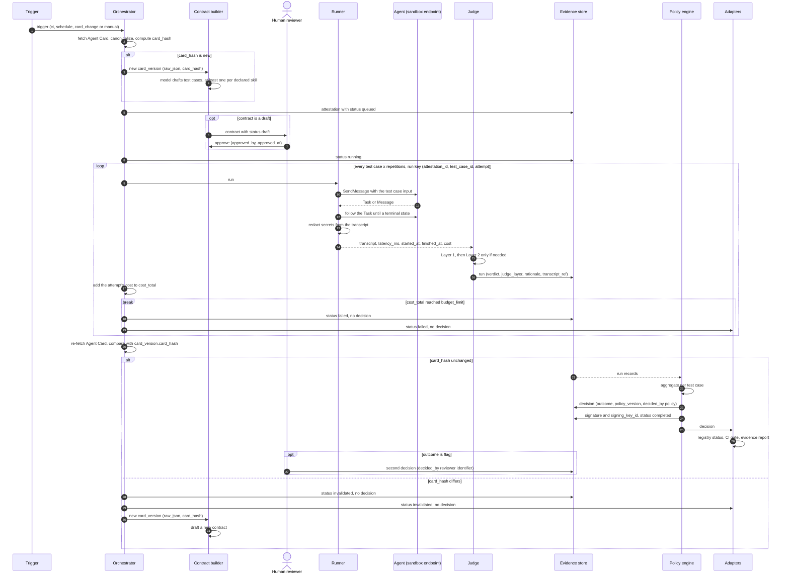
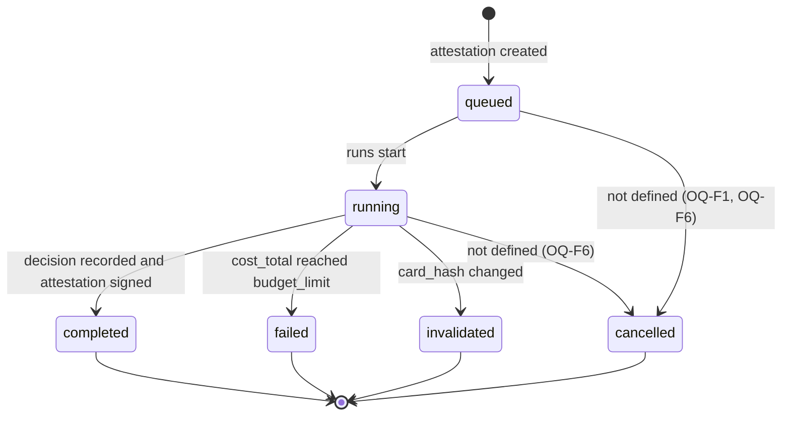

# Attestation flow

This document follows one attestation from trigger to result, then covers the
failure paths. The main flow is schema §4. The failure rules are schema §11.

Conventions are as in [ARCHITECTURE.md](ARCHITECTURE.md): "schema §N" refers
to [SCHEMA.md](../SCHEMA.md), **Proposed** marks what the schema does not
define, and `OQ-…` marks open questions. Component responsibilities are in
[ARCHITECTURE.md](ARCHITECTURE.md) and the entities in
[DATA_MODEL.md](DATA_MODEL.md).

## Main flow

Each step names the schema §4 step it expands.

### 1. Trigger arrives (schema §4, step 1)

- The trigger becomes `attestation.trigger`. Schema §4 lists CI, schedule and
  card change; schema §11 adds `manual`. So the values are `ci`, `schedule`,
  `card_change` and `manual`.
- **Proposed:** `ci` comes from a pipeline through the HTTP API, `manual` from
  a person using the CLI or the API, and `schedule` and `card_change` from
  inside Suncly ([OQ-P1](API.md#open-questions),
  [OQ-P5](API.md#open-questions)). How a card change is noticed is open
  ([OQ-F2](#open-questions)).

### 2. Fetch the card and hash it (schema §4, step 2)

- **Proposed:** the Orchestrator fetches the Agent Card from its URL,
  canonicalizes it and computes `card_hash`. The URL is not stored anywhere
  ([OQ-D2](DATA_MODEL.md#open-questions)), and canonicalization and the hash
  algorithm are open ([OQ-A7](ARCHITECTURE.md#open-questions)).
- **If the hash matches the agent's current `card_version`,** its approved
  contract is used. A hash seen earlier in the agent's history is a separate
  question ([OQ-D9](DATA_MODEL.md#open-questions)).
- **If the hash is new:**
  1. A new `card_version` is recorded with `raw_json`, `card_hash` and
     `fetched_at`.
  2. The Contract builder drafts a `contract` with `status` `draft`. It has at
     least one `test_case` per declared skill, plus probes from stage 4.
- **Proposed:** the Orchestrator creates the `attestation` with `status`
  `queued`, `started_at`, `budget_limit`, `contract_id` and `card_version_id`
  ([OQ-A7](ARCHITECTURE.md#open-questions)).
- A draft contract must be approved by a human before anything runs. Approval
  sets `status` to `approved` and fills in `approved_by` and `approved_at`.
  **Proposed:** the attestation stays `queued` until then
  ([OQ-F1](#open-questions)).

### 3. Orchestrator enqueues the runs (schema §4, step 3)

- The contract is expanded into runs: every test case times the number of
  repetitions. Each run gets a deterministic run key (`attestation_id`,
  `test_case_id`, `attempt`), with `attempt` running from 1 to the number of
  repetitions ([OQ-D3](DATA_MODEL.md#open-questions)).
- `attestation.status` becomes `running`.
- Runs are enqueued within the concurrency limits, and stateless workers pull
  them. Schema §11 says the Orchestrator *stops enqueuing* when the budget is
  reached, which implies runs are enqueued gradually rather than all at once
  ([OQ-F4](#open-questions)).

### 4. Runner executes each run, returns the transcript (schema §4, step 4)

1. The Runner picks the agent interface. When it uses the agent's own card,
   that is the first entry in `supportedInterfaces` that it supports
   (A2A §8.3.2). Which card and endpoint serve as the sandbox is open
   ([OQ-A2](ARCHITECTURE.md#open-questions)).
2. It sends the test case's `input` as an A2A Message, for example with
   `SendMessage`.
3. The agent answers with a Task or a Message (A2A §3.1.1). If it is a Task,
   the Runner follows it until it reaches a terminal state:
   `TASK_STATE_COMPLETED`, `TASK_STATE_FAILED`, `TASK_STATE_CANCELED` or
   `TASK_STATE_REJECTED`. Direct Message replies and interrupted states are
   open ([OQ-A4](ARCHITECTURE.md#open-questions)).
4. It captures every message and measures `latency_ms`, `started_at`,
   `finished_at` and `cost`.
5. It removes secrets from the transcript and returns it (schema §8).

The Orchestrator applies timeouts and retries. A retry reuses the run key, so
it cannot double count (schema §8).

### 5. Judge scores each run, writes to the evidence store (schema §4, step 5)

- Layer 1 runs the deterministic checks first: valid schema, final task state,
  required fields and the latency limit. Layer 2 runs only for criteria
  Layer 1 cannot decide.
- The Judge sets `verdict` (`pass`, `fail` or `inconclusive`), `judge_layer`,
  and `rationale` when Layer 2 decided.
- It writes the `run` record, and the transcript to object storage
  (`transcript_ref`).
- The Orchestrator adds the cost of each attempt to `attestation.cost_total`,
  including attempts that are retried (**Proposed**,
  [OQ-D1](DATA_MODEL.md#open-questions)). If `cost_total` reaches
  `budget_limit`, the [budget path](#budget-exceeded) applies.

### Card check (schema §11)

When all runs finish, the Orchestrator re-fetches and re-hashes the Agent
Card and compares the result with `card_version.card_hash`. If the hash
differs, the [card-changed path](#card-changed-mid-run) applies: step 6 does
not happen, and **Proposed:** the adapters still report the result
([OQ-A9](ARCHITECTURE.md#open-questions)).

### 6. Policy engine aggregates, decides, signs the attestation (schema §4, step 6)

- It reads the attestation's run records from the Evidence store and
  aggregates them per test case. `inconclusive` is never counted as a
  pass.
- It applies the policy for `agent.risk_level`, using the customer's
  configuration identified by `policy_version` ([POLICY.md](POLICY.md)).
- It writes a `decision` with `outcome` `approve`, `flag` or `block`,
  `decided_by` `"policy"` and `decided_at`.
- It signs the attestation over the payload defined in schema §11, and sets
  `signature` and `signing_key_id`.
- **Proposed:** `attestation.status` becomes `completed` and `finished_at` is
  set ([OQ-D6](DATA_MODEL.md#open-questions)).

### 7. Adapters push the result to registry, CI and report (schema §4, step 7)

- The **Registry adapter** writes the approval status (stage 6).
- The **CI adapter** returns pass or fail to the pipeline (stage 5). How
  decisions map to pass or fail is open
  ([OQ-A9](ARCHITECTURE.md#open-questions)).
- The **Report adapter** renders the evidence and states what was NOT tested
  ([DR-007](DECISIONS.md#dr-007-reports-state-what-was-not-tested)).

### Human resolution of a flag (schema §5, §11)

If the outcome is `flag`, a human reviews the evidence and records a second
`decision`, with `decided_by` set to the reviewer's identifier. The first
decision is never edited. No interface for recording this second decision is
defined yet ([OQ-P2](API.md#open-questions)).

## Sequence diagram

The main flow, including the card check and the budget stop.

## Attestation status

The lifecycle of `attestation.status`. Transitions marked as not defined are
open questions.

| Status | Meaning | Decision |
|---|---|---|
| `queued` | Created; runs have not started. **Proposed:** also used while the contract waits for approval ([OQ-F1](#open-questions)). | Not yet. |
| `running` | Runs are being executed and judged. | Not yet. |
| `completed` | **Proposed definition:** all runs judged, the card unchanged, a decision recorded and the attestation signed ([OQ-D6](DATA_MODEL.md#open-questions)). | Yes: `approve`, `flag` or `block`. A `flag` can be followed by a human decision. |
| `failed` | `cost_total` reached `budget_limit` (schema §11). Other causes are open ([OQ-F3](#open-questions), [OQ-F5](#open-questions)). | None (schema §11). |
| `cancelled` | Stopped before it finished. Who can cancel, and how, is not defined ([OQ-F6](#open-questions)). | **Proposed:** none ([OQ-D6](DATA_MODEL.md#open-questions)). |
| `invalidated` | The card changed during the attestation (schema §11). | None (schema §11). |

## Failure paths

### Agent unreachable

The schema does not define this path. The rules that apply are that the
Orchestrator owns retries and timeouts (schema §2), that `inconclusive` is
never a pass (schema §2), and that retries never double count (schema §8).

1. The Runner cannot connect to the agent.
2. The Orchestrator retries the run within its retry limit, under the same run
   key.
3. **Proposed:** if the agent is still unreachable, the Runner returns a
   transcript that records the failure. There is no response to judge, so
   Layer 1 records `inconclusive` with `judge_layer` `deterministic` and a
   null `latency_ms` ([OQ-D10](DATA_MODEL.md#open-questions)). Layer 2 is not
   used, because it would have nothing to judge.
4. The attestation continues. The Policy engine never counts the
   `inconclusive` runs as passes, so it cannot approve on them. Whether they
   lead to `flag` or `block` depends on thresholds that are not defined yet
   ([OQ-PO3](POLICY.md#open-questions)).
5. The report lists these runs as inconclusive and gives the reason.

A timeout is different from an unreachable agent. **Proposed:** if the agent
accepts the request but does not finish before the timeout, the run fails the
latency check and gets `fail`. Timeouts are never shorter than the latency
limit, so a slower agent can never score better than a fast one that misses
the limit ([OQ-F3](#open-questions)).

An agent that answers with an error was reachable. Examples are a Task that
ends in `TASK_STATE_FAILED` or `TASK_STATE_REJECTED`, or a protocol error. The
Judge applies the test case's criteria, which normally gives `fail`. For a
`probe_failure` test case, the criteria define what is expected
([OQ-D7](DATA_MODEL.md#open-questions)).

### Budget exceeded

From schema §11 and §8:

1. After each attempt, the Orchestrator adds its cost to `cost_total`,
   including attempts that are retried (**Proposed**,
   [OQ-D1](DATA_MODEL.md#open-questions)).
2. When `cost_total` reaches `budget_limit`, the Orchestrator stops enqueuing
   runs. Runs already in flight are an open question
   ([OQ-F4](#open-questions)).
3. The attestation ends as `failed`, `finished_at` is set, and no decision is
   made.
4. **Proposed:** the adapters still report. The CI adapter returns fail
   ([OQ-A9](ARCHITECTURE.md#open-questions)), and the report states which runs
   were never executed. That needs the planned number of repetitions, which
   is not stored ([OQ-D3](DATA_MODEL.md#open-questions)).
5. Schema §2 says each attestation is signed. What the signature of a
   `failed` attestation covers, with no decision, is open
   ([OQ-F7](#open-questions)).

### Inconclusive verdicts

From schema §2:

1. Layer 1 decides every criterion it can. The rest go to Layer 2, which uses
   a fixed rubric and the pinned model, and stores its rationale.
2. If Layer 2 cannot decide either, the verdict is `inconclusive`, with
   `judge_layer` `model` and the rationale stored. **Proposed:** a Layer 2
   model that is unavailable or returns an error also gives `inconclusive`,
   with `judge_layer` `model` and a rationale saying that no model verdict was
   available ([OQ-D4](DATA_MODEL.md#open-questions)).
3. `inconclusive` is never counted as a pass. **Proposed:** aggregated results
   show `inconclusive` separately from `pass` and `fail`.
4. The Policy engine never approves on `inconclusive` runs. Whether they count
   as borderline (`flag`) or as failing (`block`) is open
   ([OQ-PO1](POLICY.md#open-questions), [OQ-PO3](POLICY.md#open-questions)).
5. **Proposed:** the report lists `inconclusive` runs among what was NOT
   tested ([OQ-A11](ARCHITECTURE.md#open-questions)).
6. **Proposed:** the attestation still ends `completed`, because a decision is
   made ([OQ-D6](DATA_MODEL.md#open-questions)).

### Card changed mid-run

From schema §11:

1. When all runs finish, the Orchestrator re-fetches and re-hashes the Agent
   Card.
2. If the hash differs from `card_version.card_hash`, the attestation becomes
   `invalidated`, `finished_at` is set, and no decision is made.
3. A new `card_version` is recorded for the new card. This is derived: a
   contract needs a card version. The Contract builder creates a new draft
   contract for it, which waits for human approval.
4. **Proposed:** the adapters still report. The CI adapter returns fail, and
   the report states that the attestation was invalidated because the card
   changed ([OQ-A9](ARCHITECTURE.md#open-questions)). What its signature
   covers, with no decision, is open ([OQ-F7](#open-questions)).
5. Still open: whether a new attestation starts automatically once the new
   contract is approved, and what happens to a change that is reverted before
   the check ([OQ-F8](#open-questions)), or a re-fetch that fails
   ([OQ-F5](#open-questions)).

### Other cases the schema does not define

- A contract is rejected while an attestation waits for it
  ([OQ-F1](#open-questions)).
- The card cannot be re-fetched at the end ([OQ-F5](#open-questions)).
- An attestation is cancelled ([OQ-F6](#open-questions)).
- Signing fails. **Proposed:** the attestation is not marked `completed`
  ([ARCHITECTURE.md: Policy engine](ARCHITECTURE.md#policy-engine),
  [OQ-A11](ARCHITECTURE.md#open-questions)).
- An evidence write fails. **Proposed:** the run is not recorded, and the
  Orchestrator may retry it under the same run key
  ([ARCHITECTURE.md: Evidence store](ARCHITECTURE.md#evidence-store),
  [OQ-A11](ARCHITECTURE.md#open-questions)).

## Open questions

- **OQ-F1 Waiting for approval.** No `attestation.status` describes "waiting
  for contract approval". **Proposed:** the attestation stays `queued`, and
  its `contract_id` points at the draft.
  - What happens if the draft is edited into a new version?
  - What happens if the draft is rejected? **Proposed:** the attestation is
    `cancelled`.
  - Alternatively, should an attestation be created only once an approved
    contract exists?
- **OQ-F2 Noticing card changes.** A `card_change` trigger needs something to
  notice that the card changed, but no polling or notification mechanism is
  defined. Continuous monitoring is out of scope (schema §10), so this has to
  stay minimal.
- **OQ-F3 Agent unreachable, and timeouts.**
  - Should runs that cannot reach the agent be recorded as `inconclusive`
    while the attestation continues (proposed above)? Or should the
    attestation end as `failed` with no decision, as it does for the budget?
  - Should it stop early, rather than spend its budget on an agent that is
    down?
  - **Proposed:** a run that times out after the agent accepted it gets
    `fail`, because the latency limit is exceeded, and timeouts are never
    shorter than the latency limit. Please confirm.
- **OQ-F4 Budget stop details.**
  - Schema §11 implies runs are enqueued gradually. Please confirm.
  - When the limit is reached, do runs already in flight finish, and count
    toward `cost_total`, or are they cancelled?
  - How far may `cost_total` overshoot `budget_limit`?
- **OQ-F5 The final re-fetch fails.** If the card cannot be fetched when all
  runs finish, it cannot be confirmed unchanged. **Proposed:** the attestation
  ends as `failed` with no decision. `invalidated` is reserved for a card that
  actually changed.
- **OQ-F6 Cancellation.** `cancelled` exists, but no interface or rule says
  who can cancel an attestation or when.
- **OQ-F7 Signing attestations without a decision.** Schema §2 says each
  attestation is signed. Schema §11's signature payload includes the decision
  outcome, which `failed`, `invalidated` and `cancelled` attestations do not
  have. **Proposed:** they are signed with no decision outcome in the
  payload. Which component signs them, since the Policy engine only signs
  after deciding?
- **OQ-F8 After invalidation.** Does a new attestation (trigger
  `card_change`) start automatically once the new contract is approved? Also,
  the card is checked only at the end, so a change that is reverted before
  then is not detected. Is that acceptable?
